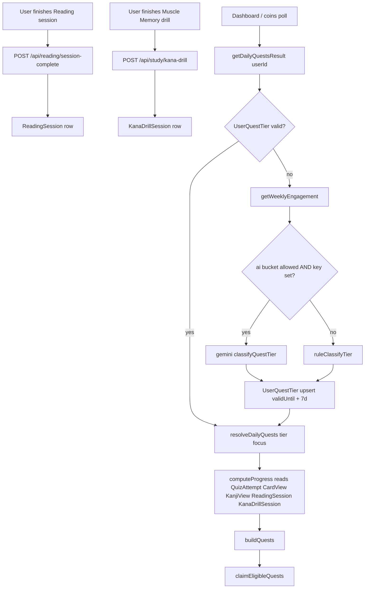

# Progressive daily quests

> **Status:** Shipped — see [README §Daily quests](../../../README.md#daily-quests)
> **Priority:** P1 · **Effort:** M · **Depends on:** none

## Why

Until this shipped, every user saw the same 5 daily quests with the same fixed
targets — "Answer 50 quiz questions", "Study 50 vocab cards", and so on. Power
users blew through the list before lunch and lost their daily-engagement nudge;
brand-new users stared down a goal that was 3-5x what they'd actually completed
on a typical day and never finished it.

Two extra problems compounded the bad shape:

- **Reading mode** and **Muscle Memory drills** existed but couldn't be quest
  sources because neither persisted "I did this today" anywhere queryable. The
  only way to credit them was to infer from coin events, which loses metadata
  (cards shown, duration) and double-pays on retries.
- **Tier inference** had to live somewhere, and nobody wanted a human to
  manually calibrate every user's targets.

This roadmap captures the system that fixes all three: persist the missing
sessions, classify the user weekly into a `(tier, focus)` pair, and resolve a
per-user quest list each day from that pair.

## Goals / non-goals

**In:**

- Persist `ReadingSession` + `KanaDrillSession` rows so quest progress can be
  computed without reading the coin ledger.
- Cache one `(tier, focus)` row per user, valid for 7 days, recomputed on
  expiry.
- Resolve today's quest list deterministically from `(tier, focus, userId,
  localDay)` — same inputs always yield the same list.
- Use Gemini Flash for tier classification when available; deterministic rule
  thresholds as the always-on fallback (rate-limited, missing key, network
  error, very-low-activity user).
- Tier badge in the daily-quests UI so users see *why* their list looks
  different than yesterday's.

**Out:**

- AI-generated quest titles or descriptions. Catalog stays curated; AI only
  picks `(tier, focus)`.
- Per-day AI calls. Cap is 1 LLM call per user per *week*.
- Retroactive seeding of `ReadingSession` / `KanaDrillSession` from history.
  Today is the cutover.
- A user-facing toggle to opt out of AI tiering — track in Open questions.
- Per-quest user customisation. The set is resolver-decided.
- Admin UI to edit tiers manually — that belongs to roadmap 12 (admin tooling).

## Data flow



## Data model

Three additive Prisma models — no edits to live tables.

```prisma
model ReadingSession {
  id          Int      @id @default(autoincrement())
  userId      String
  stage       Int      // 1..4
  set         Int      // 1..5
  sessionKey  String   @unique
  cardsShown  Int
  durationMs  Int
  completedAt DateTime @default(now())
  @@index([userId, completedAt])
}

model KanaDrillSession {
  id          Int      @id @default(autoincrement())
  userId      String
  drillKey    String   @unique
  total       Int
  correct     Int
  completedAt DateTime @default(now())
  @@index([userId, completedAt])
}

model UserQuestTier {
  userId     String   @id
  tier       String   // "starter" | "steady" | "committed" | "power"
  focus      String   // "kana" | "kanji" | "vocab" | "balanced"
  signals    Json     // weekly engagement snapshot — debug only
  source     String   // "ai" | "rule_fallback"
  computedAt DateTime @default(now())
  validUntil DateTime
}
```

Migration: `prisma/migrations/20260502010000_quests_v2`.

## Tier and focus rules

Tier (rule fallback; AI follows the same vocabulary):

- **starter**: <50 quiz Qs/wk OR <3 active days
- **steady**: 50–200 Qs OR 3–5 active days
- **committed**: 200–500 Qs OR 5–7 active days
- **power**: 500+ Qs AND 7 active days

Focus (rule fallback): the activity score with a ≥1.5x lead over the next-
highest wins, otherwise `balanced`.

| Score | Source counters |
|---|---|
| `kana` | `kanaReadingSessions × 50` + `kanaDrillSessions × 25` + `kanaViewed` |
| `kanji` | `kanjiViewed` |
| `vocab` | `cardsViewed + quizAnswered` |

Per-tier targets for the volumetric quests:

| Quest | starter | steady | committed | power |
|---|---:|---:|---:|---:|
| `answer_questions` | 20 | 50 | 100 | 150 |
| `study_cards` | 20 | 50 | 100 | 150 |
| `study_kanji` | 5 | 15 | 30 | 50 |

## Resolver shape

`resolveDailyQuests(tier, focus, userId, dayKey)` returns 4–5 quests with the
layout:

1. `first_quiz` — always-on opener, target 1
2. Scaled core: `answer_questions` (or `study_cards` when focus=vocab)
3. Focus-driven additions:
   - `kana` → `kana_reading_session` + `kana_drill_session`
   - `kanji` → `study_kanji` + `score_90_quiz`
   - `vocab` → `score_90_quiz`
   - `balanced` → 2 picks from `[kana_reading_session, kana_drill_session,
     study_kanji, score_90_quiz]` via a `hash(userId + dayKey)` Fisher-Yates
4. `all_quests` — capstone, target = number of preceding quests

## API surface

| Endpoint | Method | Purpose | Bucket |
|---|---|---|---|
| `/api/reading/session-complete` | POST | Persist a finished Reading session, claim quest if eligible | `write` |
| `/api/study/kana-drill` | POST | (extended) Now also persists `KanaDrillSession` before awarding | `write` |
| `/api/coins` | GET | (extended) Now returns `tier`, `focus`, `tierSource` alongside the quest list | `read` |

## Source files

- `src/lib/weekly-engagement.ts` — last-7-local-days aggregator
- `src/lib/quest-tier.ts` — `ruleClassifyTier` + `getOrComputeUserQuestTier`
  (AI-then-rules with 7-day cache)
- `src/lib/gemini.ts` — adds `classifyQuestTier(signals)` returning `{tier,
  focus}` JSON
- `src/lib/coins.ts` — adds `resolveDailyQuests`, `getDailyQuestsResult`;
  extends `computeProgress` with `KanjiView` / `ReadingSession` /
  `KanaDrillSession` counts; `DailyQuestId` reshaped
- `src/app/api/reading/session-complete/route.ts` — new
- `src/app/api/study/kana-drill/route.ts` — extended (persists session row)
- `src/app/quiz/kana/reading/reading-runner.tsx` — emits on stage finish,
  idempotent on `sessionKey`
- `src/components/daily-quests.tsx` — per-quest icon mapping + tier badge

## Open questions

1. **Opt-out for AI tiering.** Add a `UserProfile.useAIQuests = true | false`
   flag so privacy-conscious users (or anyone hitting their LLM org quota) can
   force the rule path? Cheap to ship, but adds a settings surface.
2. **Cold-start tier override.** Brand-new users currently default to
   `starter` / `balanced` until they trigger MIN_ACTIVITY_FOR_AI. Worth
   exposing a one-time onboarding question ("How experienced are you with
   Japanese?") that pre-seeds a higher tier?
3. **Capstone reward scaling.** Today the `all_quests` capstone is a flat 100
   coins regardless of tier. Power users complete 5 quests with much higher
   targets — should the capstone scale with tier too?
4. **AI provider abstraction.** If we ever want to A/B against OpenAI for
   quest classification, the right shape is a thin `src/lib/ai/provider.ts`
   wrapper. Not building that today; track here so the migration path is
   visible.

## Done = (acceptance checklist)

- [x] Three new Prisma models + migration
- [x] Reading runner emits to `/api/reading/session-complete` on finish
- [x] Kana drill route persists `KanaDrillSession` before awarding
- [x] `getDailyQuestsResult` returns `(tier, focus, source, quests)` and the
      dashboard renders the tier chip
- [x] AI path is gated by `GEMINI_API_KEY` + `ai` rate-limit bucket; rule
      fallback always available
- [x] README §Daily quests rewritten; §Data model + §API surface updated;
      bottom source-of-truth table extended

## README touchpoints when shipped

- `## Feature reference` → rewrite `### Daily quests` with the new dynamic
  catalog, tier table, focus areas, AI vs rules.
- `## Data model` → add rows for `ReadingSession`, `KanaDrillSession`,
  `UserQuestTier`.
- `## API surface` → add `/api/reading/session-complete` row; note that
  `/api/study/kana-drill` now persists the session row; note that `/api/coins`
  now returns `tier`/`focus`/`tierSource`.
- Bottom source-of-truth table → append `src/lib/weekly-engagement.ts`,
  `src/lib/quest-tier.ts`.
